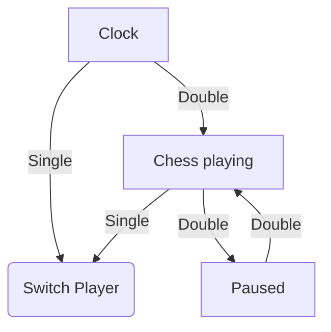

# chessclock

A clock for timing chess games.
With integrated time over WiFi and alarm clock.

## Features

- Show current time (over WiFi with NTP)
- Set chess game time
- Set alarm time
- ...

## How to

