# chessclock

A clock for timing chess games.
With integrated time over WiFi and alarm clock.

## Features

- Show current time and date (over WiFi with NTP)
- Time a chessgame
- Wake up alarm
- 18650 Battery

## How to

[graph only works in gitlab](http://gitlab.com/schlauerlauer/chessclock)

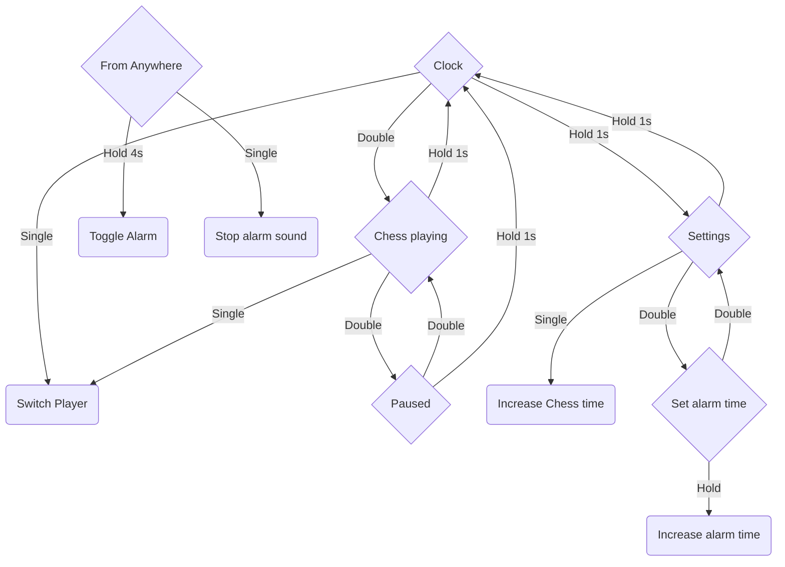

## Media

### Finished Version

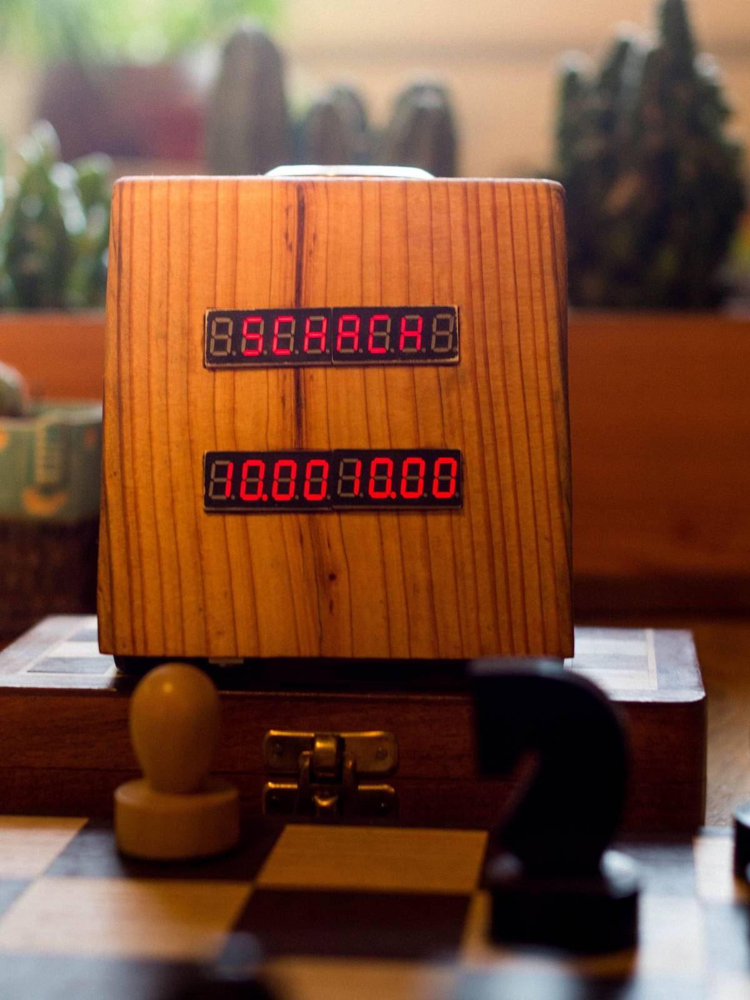
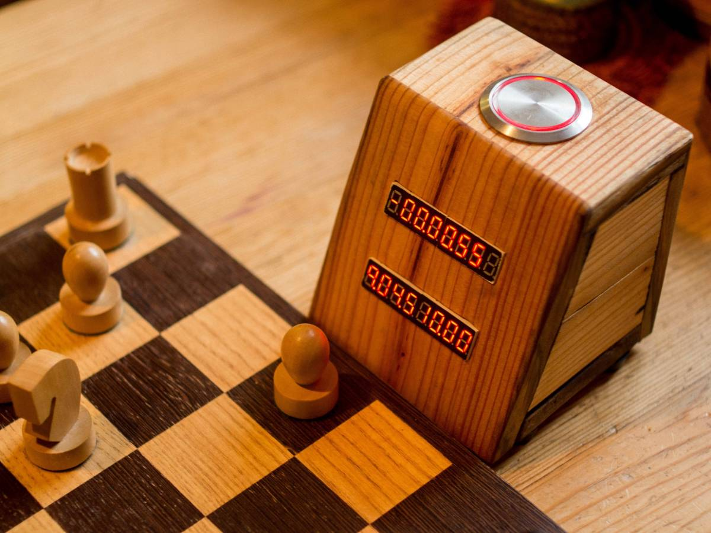
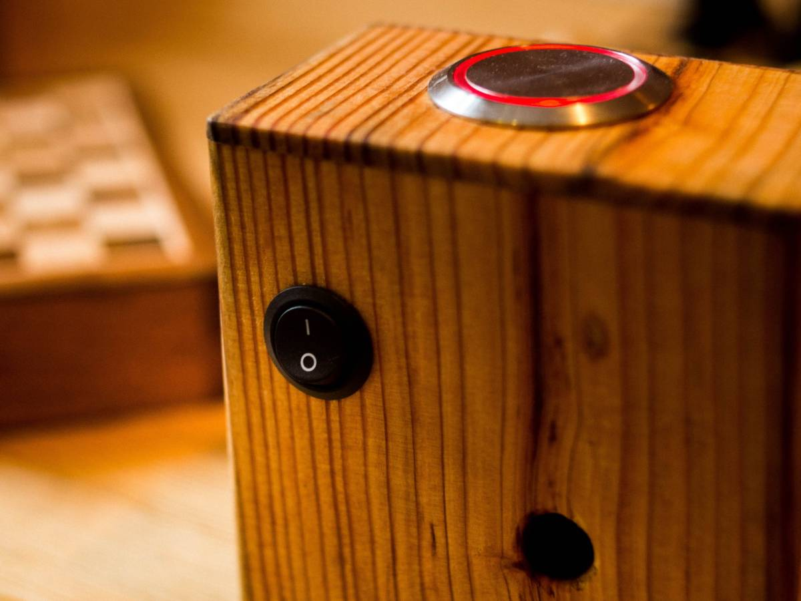
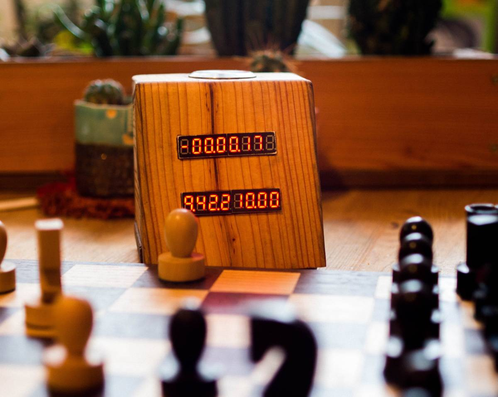

> Warning: With sound. Only works in [gitlab](https://gitlab.com/schlauerlauer/chessclock))

### Build

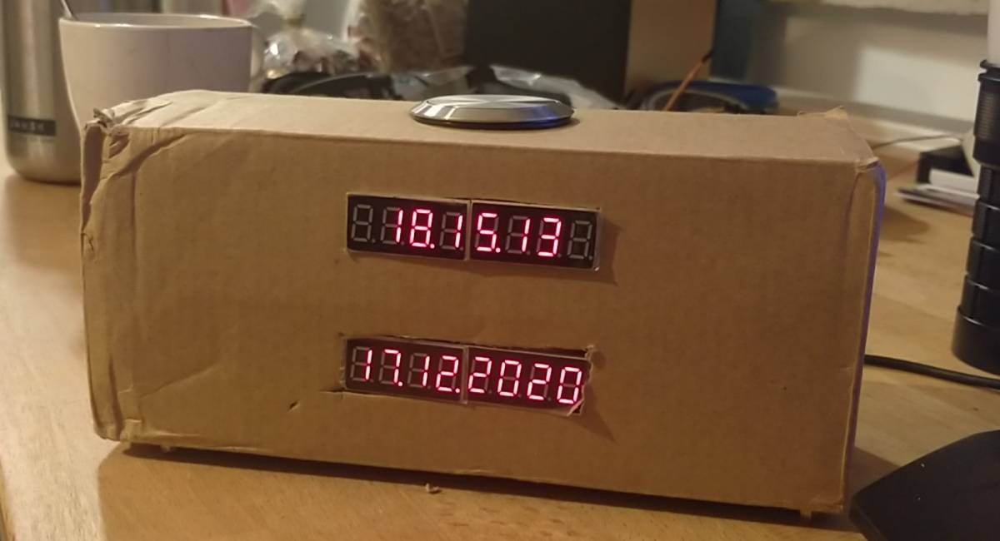
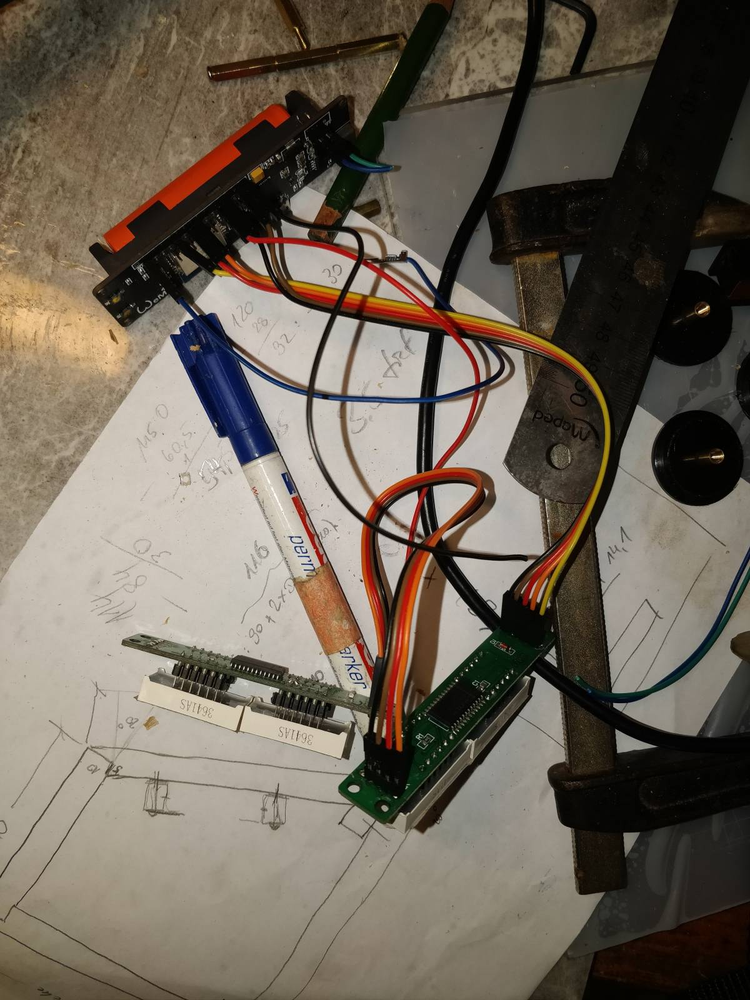
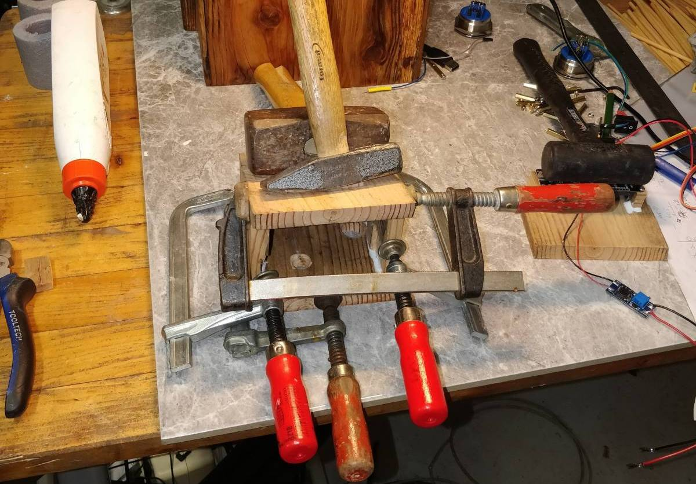
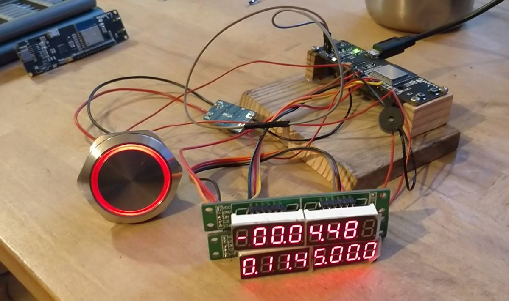
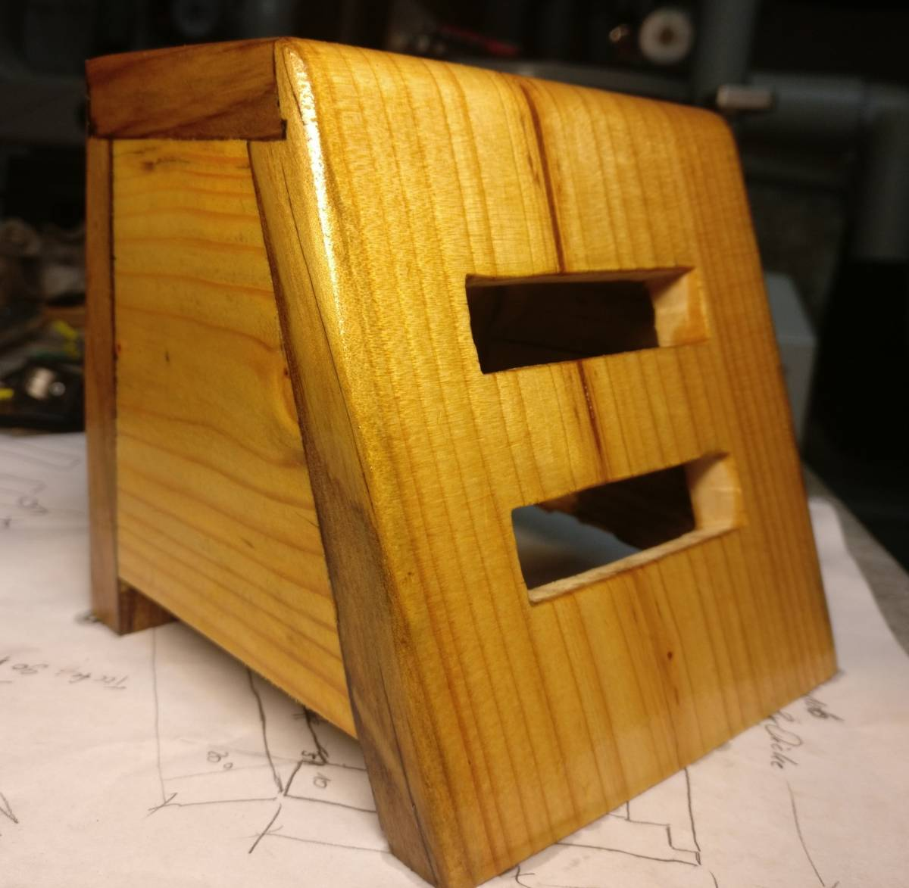
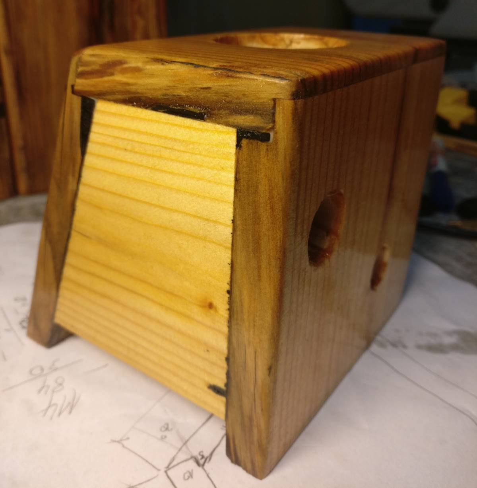
